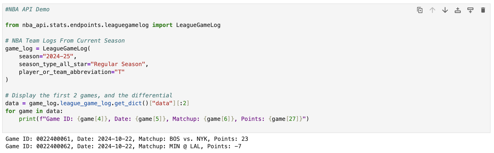

# What I've Learned about Jupyter Notebook Environemnts

After spending some time working with Jupyter notebooks, I've found them to be quite different from my usual coding environment

Two major differences I've found in my workflow from terminal bash and VS code is:

1. Cell Based execution is very helpful in letting me run and test small snippets, without requiring me to run the whole script
1. For alot of cases, the output display is already built in, meaning I don't need to code for plotting windows and print statements to see my data

I've also used Google Colab before, which is similar, but the difference is Colab runs in the cloud using GPU for my more computationally expensive tasks. 
This is definitely handy at times, but I've learned that Jupyter is alot more efficient in setting up, as all the files are already on my local machine.

I also love that in Jupyter, I can start it up by just using in terminal:

    # How I open Jupyter
    jupyter notebook

This is much easier than the wait time of connecting to a Colab GPU. That being said, my Macbook Air is not very powerful so there are still many tasks that Colab seems to be the more suitable option

In my own person projects, I like doing data analysis on sports statistics, and I can defninitely see Jupyter being beneficial in viewing and playing with this data, so I will make an effort to add it to my workflow in the future.

Here's an example screenshot:

Thanks for reading!

Francis
