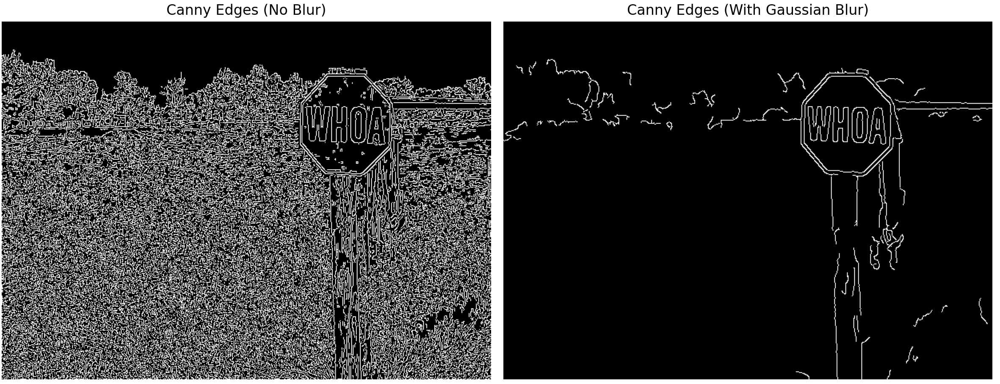

# The Use of Gaussian Blur in Edge Detection

Early on in this course, I learned that applying Gaussian blur helps a bunch with canny edge detection. The difference in the results is quite dramatic, as you can see from the images below:



## How it works

Guassian blur works by essentially replacing each pixel with a weighted average of it's neighbouring pixels, with the weights following the Guassian distribution.

Implementing this in openCV's python module is very simple.

```python
img = cv.imread("../exampleImage.jpg")
blur = cv.GaussianBlur(img, (9, 9), 0)
edges = cv.Canny(blur, 100, 200)
```

The parameters of cv.GuassianBlur:
1. First parameter 'img' is the input image
1. Second parameter '(9, 9)'is the kernal size, which determines how many neighbouring pixels to consider, and it must be an odd number
1. Third Parater '0' is the standard deviation, which when set at 0 is handled automatically

The reason this is so helpful is because it works as a preprocessing step, smoothing out the noise in an image before Canny Detection occurs.
Overall, whenever I use canny edge detection on an image, I make sure to test it with the Guassian Blur to see if it improves my models ability to detect edges.

Thanks for reading!
