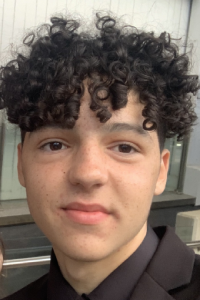

Hello and welcome to this blog. My name is Francis Weber, and I am a 4th Year Mechatronics Engineering student at the University of Queensland. This blog will outline and demonstrate what I have learned about computer vision from the fastai course.

